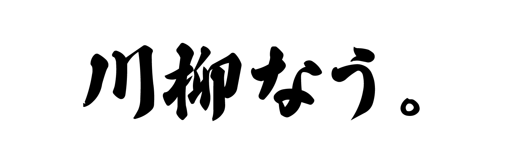

<div align="center">



### 写真ではなく、限られた言葉で日常を共有する — 新しい SNS

[](https://nextjs.org)
[](https://firebase.google.com)
[](https://senryunow.vercel.app)

**[→ アプリを開く](https://senryunow.vercel.app)**

</div>

---

## コンセプト

川柳は江戸時代の「前句付け」に由来する、即興で言葉を付け合わせる遊び。  
**写真でなく言葉で**、炎上リスクなく、今日の気分をひと句に込めて共有する SNS です。

> 「川柳って、普通の即興ラップバトルみたいなものだよな」

## 遊び方

```
1. アプリを開く
         ↓
2. 5分以内に今日の一句を詠む  ← タイムアップで投稿不可
         ↓
3. 投稿！
         ↓
4. みんなの句が解禁される  ← 投稿しないと読めない仕組み
```

投稿を続けると **5 段階ランク** が上がっていく仕組みで、継続率を向上させています。

## 主な機能

| 機能 | 説明 |
|------|------|
| **川柳モード（5・7・5）** | 定番の三句構成 |
| **短歌モード（5・7・5・7・7）** | 五句構成にも対応 |
| **パーツモード** | ランダムな単語候補から組み合わせて詠む |
| **テキストモード** | 自由入力。モーラ数をリアルタイム計測 |
| **縦書きプレビュー** | 川柳らしい縦書きで確認してから投稿 |
| **位置情報タグ** | "どこで詠んだか" を句に添える |
| **スタンプ** | 絵文字でリアクション |
| **赤ペン添削** | 川柳らしく、コメントは「添削」スタイル |
| **プロフィール & ピン留め** | 自分のお気に入りの句を固定表示 |

## UI のこだわり

- **ヘッダー固定のカウントダウン** — スクロールしても残り時間が常に見える
- **縦書き表示** — 漢字フォントと組み合わせ、和の世界観と整合
- **フィードのぼかし** — 自分が投稿するまで他の句は読めない（覗き見防止）
- **アプリ内ブラウザ検出** — LINE / Instagram 経由でも Safari/Chrome へ誘導

## 技術スタック

| 領域 | 技術 |
|------|------|
| フレームワーク | Next.js 16 (App Router) |
| UI | React 19 / Tailwind CSS v4 |
| 言語 | TypeScript |
| バックエンド | Firebase (Firestore + Google Auth) |
| 状態管理 | Zustand |
| ホスティング | Vercel |
| 制作ツール | Claude / Adobe Illustrator |

## ローカル起動

```bash
npm install
npm run dev
```

`.env.local` に Firebase の設定を追加してください。

```env
NEXT_PUBLIC_FIREBASE_API_KEY=...
NEXT_PUBLIC_FIREBASE_AUTH_DOMAIN=...
NEXT_PUBLIC_FIREBASE_PROJECT_ID=...
NEXT_PUBLIC_FIREBASE_STORAGE_BUCKET=...
NEXT_PUBLIC_FIREBASE_MESSAGING_SENDER_ID=...
NEXT_PUBLIC_FIREBASE_APP_ID=...
```

## 仕様メモ

- 1日の区切りは **JST 15:00**（前日 15:00 〜 当日 14:59 が同じ「今日」）
- 1ユーザー 1日 1句まで
- ランク：5 段階（投稿数に応じて上昇）

## 今後の展望

現在、**React Native（Expo）** を用いたアプリ版の開発を進めています。  
Google ログインやプッシュ通知など、よりアプリらしい体験へブラッシュアップ中。

---

<div align="center">

製作期間：2 日（2026.5.27〜5.28） / 個人開発（自主制作）  
`#バイブコーディング` `#UI/UX デザイン` `#SNS`

</div>
